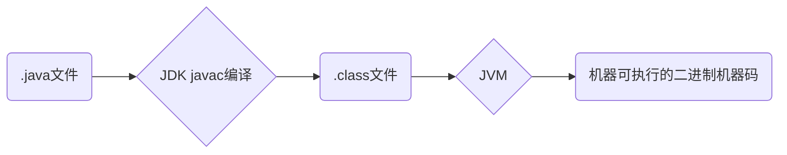

### 面向过程VS面向对象

* 面向过程： 是一种以事件为中心的编程思想，编程的时候把解决问题的步骤分析出来，然后用函数把这些步骤实现，再一步一步按顺序调用函数。所以面向过程编程重点是分析解决问题的步骤。
  * 面向对象性能比面向对象高，因为面向对象类调用时需要实例化，开销比较大，比较消耗资源，当性能是重要的考量因素时，比如单片机、嵌入式开发、Linux/Unix等一般采用面向过程开发。
  * 但面向过程没有面向对象易维护、易复用、易拓展。

* 面向对象：当问题的规模变大时，面向过程就不再够用，就有了面向对象的编程思想。面向对象是一种以对象为中心的编程思想，把要解决的问题分解成为各个对象，建立对象的目的不是为了完成一个步骤，而是为了描述某个对象在整个解决问题的步骤中的属性和行为。

_Java性能差的主要原因并不是因为它是面向对象语言，而是Java时半编译语言，最终执行的代码并不是可以直接被CPU执行的二进制机械码。而面向过程语言大多都是直接编译成机械码在电脑上执行，其它一些面向过程的脚本语言性能不一定比Java好。_

### 面向对象编程三大特性：封装、继承、多态

* 封装把一个对象的属性私有化，同时提供一些可以被外界访问的属性的方法。

* 继承是使用已经存在的类的定义作为基础建立新类的技术。新类的定义可以增加新的数据或新的功能。也可以用父类的功能。但不能选择性的继承父类。通过继承可以方便的复用代码。

  * 子类拥有父类对象所有的属性和方法（包括私有属性和方法）。但是子类无法访问父类中的私有属性和方法，只是拥有。
  * 子类可以对父类进行extend,即拥有自己的属性和方法。
  * 自类可以用自己的方式实现父类的方法(override)。

* 多态是指程序中定义的引用变量所指向的具体类型和通过该reference variable发出的方法调用在编程时并不是确定的，而是在程序运行期间在确定，即一个reference到底会指向哪个类的实例对象。

  Java中有两种形式可以实现多态：继承和接口。

 ### Java语言特性

1. 面向对象（封装，继承，多态）
2. 平台无关性（JVM实现平台无关性）
3. 安全可靠
4. 支持多线程
5. 支持网络编程（Java语言是为了简化网络编程设计的，因此Java支持网络编程且很方便）
6. 编译与解释并存

### JVM JDK and JRE

**JVM**

JVM是运行Java字节码的虚拟机。JVM有针对不同系统的特定实现(Windows,Linux,macOS),这就是为什么Java可以跨平台，是因为JVM有针对不同系统有特定的实现，目的是使用相同的字节码，它们会给出相同的结果。

**字节码**

在Java中，JVM可理解的代码就叫做字节码(即拓展名为`.class`的文件)，它不面向任何特定的处理器，只面向虚拟机。Java语言通过字节码的方式在一定程度上解决了传统解释型语言执行效率低的问题，同时又保留了解释型语言可移植性的特点。所以Java程序运行时比较高效，而且，由于字节码并不针对一种特定的机器，**Java程序无需重新编译便可在多种不同操作系统的计算机上运行，只要有`.class`文件便可以在不同操作系统运行。**

**Java程序从源代码到运行的步骤：**



需要注意的是`.class`->机器码这一步，JVM类加载器首先加载字节码文件，然后通过解释器(解释器作用于字节码，产生机器码)逐行解释执行，这种方式的执行速度会相对比较慢。而且，有些方法和代码块是经常需要被调用的(即所谓的热点代码),所以引进了JIT编译器，JIT属于运行时编译。当JIT编译器完成第一次编译后，会将字节码(.class)对应的机器码保存下来，下次调用时可以直接使用。我们知道，机器码的运行效率高于Java解释器，这也解释了Java为什么是编译与解释共存的文件。

**字节码和不同系统的JVM实现是Java语言‘一次编译，随处运行’的原因。**

**JDK 和 JRE**

JDK(Java Developement Kit)是功能齐全的Java SDK。它拥有JRE有的一切，还有编译器(javac)和工具(如javadoc和job)。它能够创建和编译程序。

JRE是Java运行时环境。它是运行已编译Java程序所需的所有内容的集合，包括JVM，Java类库，Java命令和其他的一些基础构件，**但是JRE不能用于创建新程序**。

### Java VS C++

* 都是面向对象语言，支持封装，继承，多态性。
* Java中没有指针来直接访问内存，内存使用更加安全。
* Java的类是单继承的,C++支持多重继承，虽然java的类不可以多继承，但是interface可以多继承。
* Java有自动内存管理机制，不需要程序员手动释放无用内容。
* 在C语言中，字符串或字符数组最后都会有一个额外的字符'\0'来表示结束。但是Java语言中没有结束符这一概念。

### Java 程序主类，应用程序VS小程序

一个程序中可以有多个类，但只能有一个类是主类。主类是Java程序执行的入口。

* 在Java应用程序中,主类包含`main()`方法。此主类不一定是public的。应用程序是从主线程启动(也就是`main()`方法)。
* 在Java小程序中，主类是继承自系统类JApplet或Applet的子类。此主类一定是public的。Applet小程序没有`main()`方法，主要是嵌在浏览器页面上面运行,调用`init()`或者`run()`启动。

### Constructor 能否被 override?

父类的private属性和constructor不能被继承，所以Constructor不能被override,但是可以overload，所以一个类可以有多个构造函数的情况。

### Overload VS Override

* Overload 发生在同一个类中，方法名必须相同，参数类型，个数，顺序不同，方法返回值和访问修饰符可以不同。编译器必须挑选出具体执行哪个方法，它通过用各个方法的参数类型与特定方法调用所使用的值类型进行匹配挑选出相应的方法。如果找不到匹配的参数，就会发生编译错误。(这个过程称做overloading resolution.)

  要完整的描述一个方法，需要指出方法名以及参数类型，这叫做方法的signature。**返回类型不是signature的一部分，也就是说不能有两个方法名和参数完全一致但返回类型却不一样的方法。**

* Override 是子类对父类的允许访问的方法实现过程进行重新编写，发生在子类中。**方法名，参数列表必须相同，返回值范围子类小于父类，抛出异常的范围子类小于父类，访问修饰符的范围子类大于父类。**如果父类方法修饰符为private就不能重写该方法。

### StringBuffer VS StringBuilder VS String

**String不可变性**

String类中使用final关键字修饰字符数组来保存字符串，`private final char value[]`，所以String对象是不可变的。而 StringBuilder 和 StringBuffer都继承自 AbstractStringBuilder 类，在 AbstractStringBuilder 中也是 使用字符数组保存字符串 `char value[]`但是没有关键字 `final`修饰，所以 StringBuilder 和 StringBuffer是可变的。

**线程安全性**

* String中的对象是不可变的，可以理解为常量，线程安全。
* AbstractStringBuilder 是 StringBulider 和 StringBuffer 的公共父类，定义了一些字符串的基本操作，如expandCapacity、append、insert、indexOf 等公共方法。StringBuffer 对方法加了同步锁或者对调用的方法加了同步锁，所以是线程安全的。
* StringBuilder没有对方法加同步锁，线程非安全。

**性能**

对String进行改变时，要生成一个新的String对象，然后将指针指向新的String对象。StringBuffer每次都会对对象本身进行操作，而不是生成新的对象并改变对象引用。相同情况下使用StringBuilder相比使用StringBuffer仅能获得10%~15%左右的性能提升，但却是线程不安全的。

**总结**

* 操作少量的数据：String
* 单线程操作字符串缓冲区下操作大量数据：StringBuilder
* 多线程操作字符串缓冲区下操作大量数据：StringBuffer

### 自动装箱与拆箱

* 装箱：将基本类型用它们对应的引用类型包装起来。(char->Character)
* 拆箱：将包装类型转换为基本数据类型。(Character->char)

### 为什么不能在静态方法中调用非静态变量

静态方法不可用过对象进行调用。因此在静态方法里，不能调用其他非静态变量，也不可以访问非静态变量成员。

### 为什么要定义一个没有行为且没有参数的Constructor

Java程序在执行子类的Constructor之前，如果没有用`super()`来调用父类特定的constructor, 则会调用父类中没有参数的构造方法。因此，如果父类中只定义了有参数的构造方法，而子类又没有用`super()`来调用父类特定的构造方法是，则编译时会发生错误，因为Java在父类中找不到没有参数的构造方法可供执行。

### Abstract class VS Interface

* 在接口中，所有方法不能有实现(Java 8 开始接口方法可有默认实现)。抽象类可以有非抽象的方法。
* 接口中除了static final变量，不能有其他变量，而抽象类不一定。
* 一个类可以实现多个接口，但只能实现一个抽象类。接口自己本身可以extend多个接口。
* 接口的方法默认是public，抽象方法可以有public，protected和default这些修饰符(不可以private，因为抽象方法就是为了被重写的)

### Constructor

构造方法是用来初始化class object。若一个类没有构造方法也可以执行，因为一个类即使没有声明构造方法也会有默认的不带参数的构造方法。

* 构造方法名字与类相同
* 没有返回值，但不能用void声明构造函数
* 声称累的对象时自动执行，无需调用

### 静态方法 VS 实例方法

1. 静态方法可以使用'类名.方法名'和‘对象.方法名'调用。实例方法只可以用'对象.方法名‘ 调用。静态方法可以不需要创建对象就调用。
2. 静态方法在访问本类的成员时，只允许访问静态成员（静态成员变量和静态方法)。不可以访问实例成员变量和实例方法。

### hashcode() and equals

Java的任何类都包含hashCode()函数。

1. 如果两个对象相等，hashcode一定相同。
2. 如果两个对象相等，对两个对象分别调用eqauls都返回true。
3. 两个对象有相同的hashcode值，他们不一定是相等的。
4. **equals方法如果被覆盖，hashcode也必须被覆盖**
5. hashCode() 的默认行为是对堆上的对象产生特殊值，如果没有重写hashCode()，则该类的两个对象无论如何都不会相等。

### final 关键字

final主要用在三个地方：变量、方法、类

* 对一个final变量，如果是基本数据类型的变量，则其数值一旦在初始化后便不能更改，如果是引用类型的变量，则初始化后不能再指向另一个对象。
* **当用final修饰一个类时，表明这个类不能被继承。**final类中的所有成员方法都会被隐式地指定为final方法。
* 使用final的原因：
  * 把方法锁定，防止继承时被修改。
  * 提升效率（早期）

### Java中的异常处理

在 Java 中，所有的异常都有一个共同的祖先java.lang包中的 **Throwable类**。Throwable： 有两个重要的子类：**Exception（异常）** 和 **Error（错误）** ，二者都是 Java 异常处理的重要子类，各自都包含大量子类。

**Error（错误）:是程序无法处理的错误**，表示运行应用程序中较严重问题。大多数错误与代码编写者执行的操作无关，而表示代码运行时 JVM（Java 虚拟机）出现的问题。例如，Java虚拟机运行错误（Virtual MachineError），当 JVM 不再有继续执行操作所需的内存资源时，将出现 OutOfMemoryError。这些异常发生时，Java虚拟机（JVM）一般会选择线程终止。

这些错误表示故障发生于虚拟机自身、或者发生在虚拟机试图执行应用时，如Java虚拟机运行错误（Virtual MachineError）、类定义错误（NoClassDefFoundError）等。这些错误是不可查的，因为它们在应用程序的控制和处理能力之 外，而且绝大多数是程序运行时不允许出现的状况。对于设计合理的应用程序来说，即使确实发生了错误，本质上也不应该试图去处理它所引起的异常状况。在 Java中，错误通过Error的子类描述。

**Exception（异常）:是程序本身可以处理的异常**。Exception 类有一个重要的子类 **RuntimeException**。RuntimeException 异常由Java虚拟机抛出。**NullPointerException**（要访问的变量没有引用任何对象时，抛出该异常）、**ArithmeticException**（算术运算异常，一个整数除以0时，抛出该异常）和 **ArrayIndexOutOfBoundsException** （下标越界异常）。

**注意：异常和错误的区别：异常能被程序本身处理，错误是无法处理。**

**Throwable类常用方法**

- **public string getMessage()**:返回异常发生时的简要描述
- **public string toString()**:返回异常发生时的详细信息
- **public string getLocalizedMessage()**:返回异常对象的本地化信息。使用Throwable的子类覆盖这个方法，可以生成本地化信息。如果子类没有覆盖该方法，则该方法返回的信息与getMessage（）返回的结果相同
- **public void printStackTrace()**:在控制台上打印Throwable对象封装的异常信息

**异常处理总结**

- **try 块：** 用于捕获异常。其后可接零个或多个catch块，如果没有catch块，则必须跟一个finally块。
- **catch 块：** 用于处理try捕获到的异常。
- **finally 块：** 无论是否捕获或处理异常，finally块里的语句都会被执行。当在try块或catch块中遇到return 语句时，finally语句块将在方法返回之前被执行。

**在以下4种特殊情况下，finally块不会被执行：**

1. 在finally语句块第一行发生了异常。 因为在其他行，finally块还是会得到执行
2. 在前面的代码中用了System.exit(int)已退出程序。 exit是带参函数 ；若该语句在异常语句之后，finally会执行
3. 程序所在的线程死亡。
4. 关闭CPU。

### Java 序列化，使用tansient修饰不想进行序列化的字段

transient: 阻止实例中那些用此关键字修饰的变量序列化，当对象被反序列化时，被transient修饰的变量值不会被持久化和恢复。transient只能修饰变量，不能修饰类和方法。

### 获取用键盘输入的方法

1. Scanner

```java
Scanner input = new Scanner(System.in);
String s = input.nextLine();
input.close();
```

2. BufferReader

```java
BufferReader input = new BufferReader(new InputStreamReader(System.in));
String s = input.readLine();
```

### Java中的IO流

**Java 中 IO 流分类**

- 按照流的流向分，可以分为输入流和输出流；
- 按照操作单元划分，可以划分为字节流和字符流；
- 按照流的角色划分为节点流和处理流。

Java Io流共涉及40多个类，这些类看上去很杂乱，但实际上很有规则，而且彼此之间存在非常紧密的联系， Java I0流的40多个类都是从如下4个抽象类基类中派生出来的。

- InputStream/Reader: 所有的输入流的基类，前者是字节输入流，后者是字符输入流。
- OutputStream/Writer: 所有输出流的基类，前者是字节输出流，后者是字符输出流。

按操作方式分类结构图：

[](https://camo.githubusercontent.com/639ec442b39898de071c3e4fd098215fb48f11e9/68747470733a2f2f6d792d626c6f672d746f2d7573652e6f73732d636e2d6265696a696e672e616c6979756e63732e636f6d2f323031392d362f494f2d2545362539332538442545342542442539432545362539362542392545352542432538462545352538382538362545372542312542422e706e67)

**既然有了字节流,为什么还要有字符流**

问题本质想问：**不管是文件读写还是网络发送接收，信息的最小存储单元都是字节，那为什么 I/O 流操作要分为字节流操作和字符流操作呢？**

回答：字符流是由 Java 虚拟机将字节转换得到的，问题就出在这个过程还算是非常耗时，并且，如果我们不知道编码类型就很容易出现乱码问题。所以， I/O 流就干脆提供了一个直接操作字符的接口，方便我们平时对字符进行流操作。如果音频文件、图片等媒体文件用字节流比较好，如果涉及到字符的话使用字符流比较好。

### Equals 方法的使用

Object的equals方法容易抛出空指针异常，应使用常量或者确定有值的对象来调用equals。

```java
// 值为null的引用类型变量调用非静态方法会抛出异常
String str = null;
if (str.equals("java")) {
  ...
}
// 下面这样就不会抛出异常
if ("java".equals(str)) {
  ...
}
// 还可以使用java.util.Obejcts#equals
Objects.equals(null,"java"); //false
```

null是任何引用类型包括Object类型的默认值，调用非静态方法会抛出异常。

**Tip:**

为了避免内存溢出，我们在无需类外调用的方法前，一般不加static关键字（因为静态方法会常驻内存，其生存周期与整个项目的生存周期是一致的）所以，我们应该在为变量赋初值的时候，尽量不要使用null来赋初值，如果一定是null作为初值的情况，那么在进行操作时，一定要先 Assert.isNull 一下，尽量避免对null进行操作。回到equals方法上，如果一个初值可能为空的对象实例，调用equals方法时，一定要遵循 “常量”.equals(变量) 或者 后输入的.equals(之前的)。这样就可以尽量避免空指针错误，平时多注意，养成习惯，防止日后埋下隐患。
原文链接：https://blog.csdn.net/tick_tock97/article/details/72824894

**总结就是，为了避免溢出，我们会用非静态方法，所以我们要尽量避免null作为初始值，在调用方法前要判断一下是不是null**

### 整型包装类值的比较

所有整型包装类对象值的比较必须用equals方法。

```java
Integer x = 3; // 自动装箱
Integer y = 3;
// 当使用自动装箱方式创建一个Integer对象时，当数值在-128 ~127时，会将创建的 Integer 对象缓存起来，当下次再出现该数值时，直接从缓存中取出对应的Integer对象。所以上述代码中，x和y引用的是相同的Integer对象。
System.out.println(x == y);// true 实际上比较的还是引用，而不是数值
Integer a = new Integer(3);
Integer b = new Integer(3);
System.out.println(a == b);//false
System.out.println(a.equals(b));//true
```

### BigDecimal

**BigDecimal 的用处**

**浮点数之间的等值判断，基本数据类型不能用==来比较，包装数据类型不能用 equals 来判断。** 具体原理和浮点数的编码方式有关。

```java
float a = 1.0f - 0.9f;
float b = 0.9f - 0.8f;
System.out.println(a);// 0.100000024
System.out.println(b);// 0.099999964
System.out.println(a == b);// false
```

输出并不是我们想要的结果（**精度丢失**），我们如何解决这个问题呢？一种很常用的方法是：**使用 BigDecimal 来定义浮点数的值，再进行浮点数的运算操作。**

```java
BigDecimal a = new BigDecimal("1.0");
BigDecimal b = new BigDecimal("0.9");
BigDecimal c = new BigDecimal("0.8");
BigDecimal x = a.subtract(b);// 0.1
BigDecimal y = b.subtract(c);// 0.1
System.out.println(x.equals(y));// true 
```

**BigDecimal 的大小比较**

`a.compareTo(b)` : 返回 -1 表示小于，0 表示 等于， 1表示 大于。

```java
BigDecimal a = new BigDecimal("1.0");
BigDecimal b = new BigDecimal("0.9");
System.out.println(a.compareTo(b));// 1
```

**BigDecimal 保留几位小数**

通过 `setScale`方法设置保留几位小数以及保留规则。保留规则有挺多种，不需要记，IDEA会提示。

```java
BigDecimal m = new BigDecimal("1.255433");
BigDecimal n = m.setScale(3,BigDecimal.ROUND_HALF_DOWN);
System.out.println(n);// 1.255
```


### static, final, this, super

[https://gitee.com/SnailClimb/JavaGuide/blob/master/docs/java/Basis/final%E3%80%81static%E3%80%81this%E3%80%81super.md](https://gitee.com/SnailClimb/JavaGuide/blob/master/docs/java/Basis/final、static、this、super.md)

### 参考

* [https://github.com/Snailclimb/JavaGuide/blob/master/docs/java/Java%E5%9F%BA%E7%A1%80%E7%9F%A5%E8%AF%86.md#32-java-%E4%B8%AD%E7%9A%84%E5%BC%82%E5%B8%B8%E5%A4%84%E7%90%86](https://github.com/Snailclimb/JavaGuide/blob/master/docs/java/Java基础知识.md#32-java-中的异常处理)